___

# U1. A2. Instalación De MySQL Community Sobre Windows.

En este informe vamos a hacer la instalación de MySQL Community y de MySQL Workbench, ambos en Windows 7.

---

# 1. Descarga De MySQL Community En Windows 7 (Server).

Para hacer esta instalación debemos ir a la página de MySQL y debemos  descargarnos [MySQL Installer 5.7.19](https://dev.mysql.com/downloads/windows/installer/5.7.html).

___

# 2. Instalación Previa De MySQL En Windows 7 (Server).

Antes de instalar el MySQL Installer 5.7.19, tenemos que instalar dos programas para poder instalarlo.

* Lo primero que instalamos es el .NET Framework 4.5.2. Para ello nos lo descargamos de la página web de [.NET Framework 4.5.2.](https://www.microsoft.com/es-ES/download/details.aspx?id=42642) y lo instalamos como podemos ver en las siguientes imágenes.

* Lo segundo que instalamos es el Microsoft Visual C++ 2015 Redistributable (x64). Para ello nos lo descargamos de la página web de [Microsoft Visual C++ 2015](https://www.microsoft.com/es-es/download/details.aspx?id=52685) y lo instalamos como podemos ver en las siguientes imágenes.

# 3. Instalación De MySQL En Windows 7 (Server).

Ejecutamos el msi que nos descargamos del MySQL Installer 5.7.19. Para poder hacer la instalación solo tenemos que seguir las siguientes imágenes.

La instalación de MySQL Community debe ser en modo Developer Default.

Le damos a ejecutar antes de seguir.

Seguimos con las opciones por defecto.

Le volvemos a dar a ejecutar.

Seguimos con las opciones por defecto.

Le ponemos una contraseña a nuestra cuenta de root.

Seguimos con las opciones por defecto.

Volvemos a darle a ejecutar.

Seguimos con las opciones por defecto.

Le damos a Check para que compruebe que la contraseña concuerda con la contraseña de la cuenta del usuario root.

Seguimos con las opciones por defecto.

Finalmente ya tenemos instalado el MySQL Installer 5.7.19

Anteriormente nos dio un problema instalando el MySQL Workbench 6.3.9 (x64), lo que hacemos es instalarlo ahora. Lo añadimos como que queremos instalarlo y continuamos.

Le damos a ejecutar.

Le damos a siguiente.

Finalmente ya tenemos instalado el MySQL Workbench 6.3.9.

Entramos a la línea de comandos cuando ya se nos haya instalado el MySQL 5.7.19.

Comprobamos que podemos acceder a las bases de datos que vienen por defecto de MySQL.

También tenemos que comprobar que nuestro Servicio este activo en el Servidor MySQL, lo que tenemos que hacer es ir a Servicios y comprobamos que MySQL57 esta iniciado.

También lo podemos comprobar mediante comandos con el comando net start en la línea de comandos.

___

# 4. Ruta De Instalación De MySQL En Windows 7 (Server).

Para ver la ruta donde se instala MySQL tenemos que ir a Archivos de Programa y luego a la carpeta MySQL.

Entramos en MySQL Server 5.7 y comprobamos los ficheros que tenemos dentro.

Entramos en la carpeta bin y vemos que archivos nos encontramos dentro.

Ahora volvemos a nuestro Disco Local y activamos la opción de poder ver los archivos ocultos y entramos en la carpeta ProgramData.

Dentro de esta carpeta entramos a la carpeta de MySQL y luego a MySQL Server 5.7. Dentro de MySQL Server 5.7 nos encontramos con un fichero que se llama my.ini, este será el archivo de la ruta que tiene que aparecer en el MySQL Workbench 6.3.9. del Cliente.

Entramos en la carpeta Data y vemos las bases de datos que nos vienen por defecto.

___

# 5. Descarga De MySQL Workbench En Windows 7 (Cliente).

Para hacer esta instalación debemos ir a la página de MySQL y debemos  descargarnos [MySQL Workbench 6.3.9](https://dev.mysql.com/downloads/workbench/).

___

# 6. Instalación Previa De MySQL Workbench En Windows 7 (Cliente).

Antes de instalar el MySQL Workbench 6.3.9, tenemos que instalar dos programas para poder instalarlo.

* Lo primero que instalamos es el .NET Framework 4.5.2. Para ello nos lo descargamos de la página web de [.NET Framework 4.5.2.](https://www.microsoft.com/es-ES/download/details.aspx?id=42642) y lo instalamos como podemos ver en las siguientes imágenes.

* Lo segundo que instalamos es el Microsoft Visual C++ 2015 Redistributable (x64). Para ello nos lo descargamos de la página web de [Microsoft Visual C++ 2015](https://www.microsoft.com/es-es/download/details.aspx?id=52685) y lo instalamos como podemos ver en las siguientes imágenes.

___

# 7. Instalación De MySQL Workbench En Windows 7 (Cliente).

Ejecutamos el msi que nos descargamos del MySQL Workbench 6.3.9. y para poder hacer la instalación solo tenemos que seguir las siguientes imágenes.

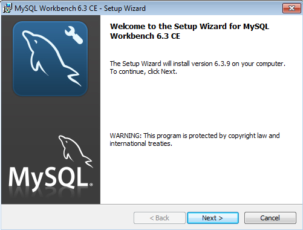

Seguimos con las opciones por defecto.

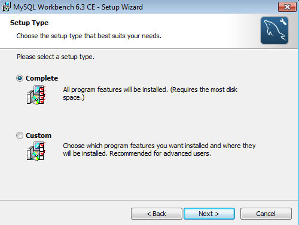

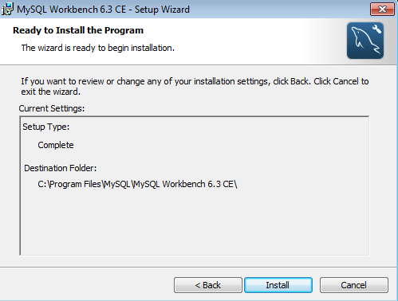

# 8. Crear Usuario En El Servidor.

Lo primero es crear un usuario en el Servidor, con otro nombre distinto al root, en mi caso se llama noelia, tiene una contraseña para poder acceder y también le damos como que se pueda acceder desde cualquier Cliente.

Luego le damos el role de DBA.

Dejamos al usuario root solo con localhost.

# 9. Configuración Modo Remoto En El Servidor De MYSQL Desde Workbench.

También en Options File, en Networking señalamos la opción bind-address, en concreto * .

# 10. Conectarse Con El Workbench Cliente Al Servidor.

Ahora tenemos que volver al cliente y ponemos nuestros datos que hemos creado en el Workbench Servidor.

Nos pide la contraseña que hemos creado.

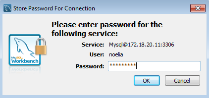

Finalmente nos deja entrar desde el Workbench del Cliente al Workbench del Servidor.

Para probarlo podemos ver que que visualizando las bases de datos que tenemos en el Servidor.

___

# 11. Descarga De Xampp.

Para hacer esta instalación debemos ir a la página de Xampp y debemos  descargarnos [Xampp 7.1.9](https://www.apachefriends.org/es/download.html).

___

# 12. Instalación De Xampp.

Ejecutamos el msi que nos descargamos del Xampp 7.1.9. y para poder hacer la instalación solo tenemos que seguir las siguientes imágenes.

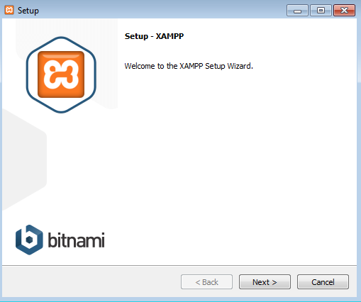

Seguimos con las opciones por defecto.

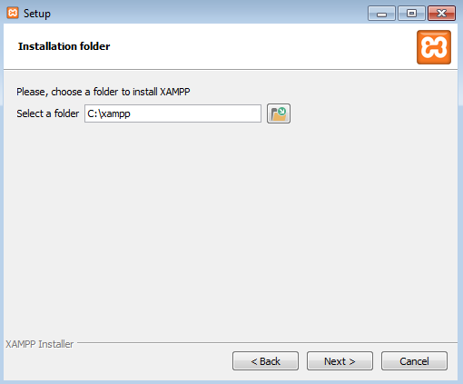

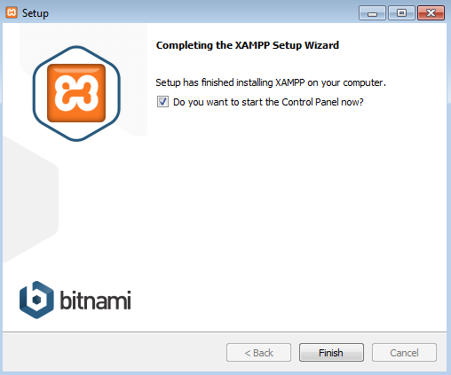

Finalmente se nos ha instalado Xampp 7.1.9.

# 13. Configuración de phpMyAdmin.

Ahora tenemos que activar en el Xampp el Apache para poder acceder a phpMyAdmin.

Ahora vamos a los ficheros de phpMyAdmin (estan dentro de Xampp). Aqui tenemos que modificar el archivo php que se llama config.inc.php.

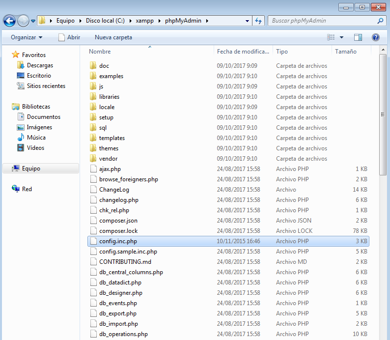

Ahora ponemos una contraseña para phpMyAdmin.

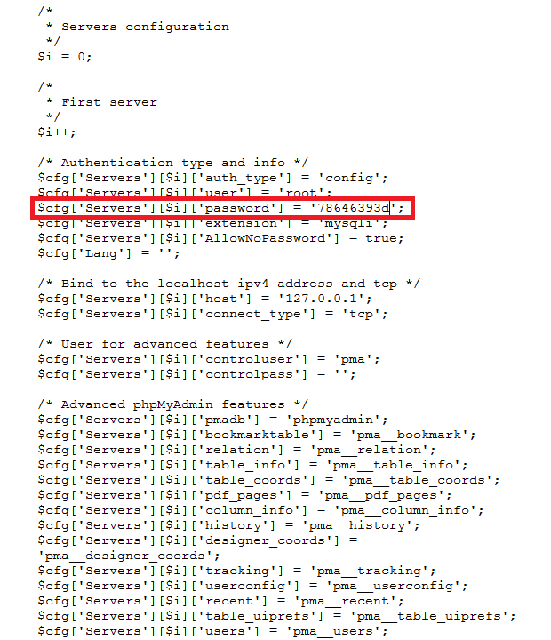

Vamos a la ruta del Xampp, phpMyAdmin y luego sql. Ahí tenemos que entrar en create_tables.

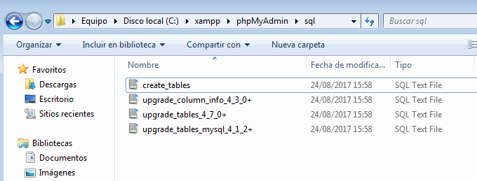

Ahora le damos a ejecutar y queremos que nos cree esa base de datos que nos aparece.

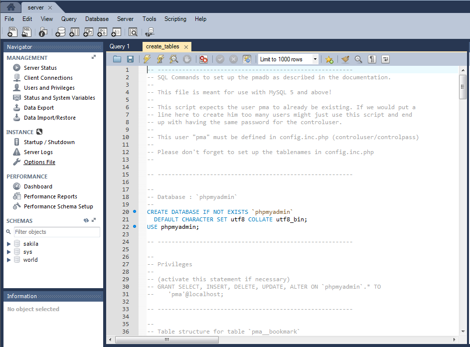

Ahora creo otro usuario para phpMyAdmin.

Luego volvemos a ir a Xampp, phpMyAdmin y tenemos que cambiar el archivo php que se llama config.inc.php.

Lo que tenemos que hacer en ese archivo es añadir el control pass.

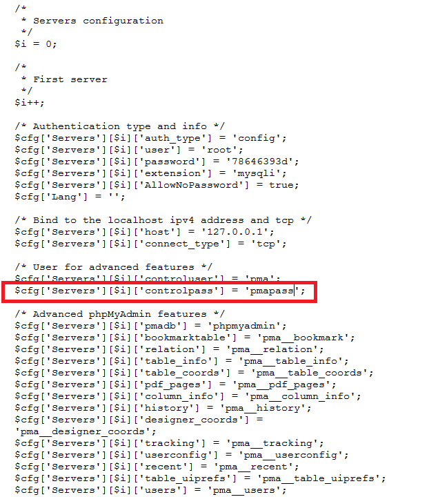

Volvemos a Xampp y pinchamos en Admin de Apache y se nos abrira un navegador.

Abrimos phpMyAdmin.

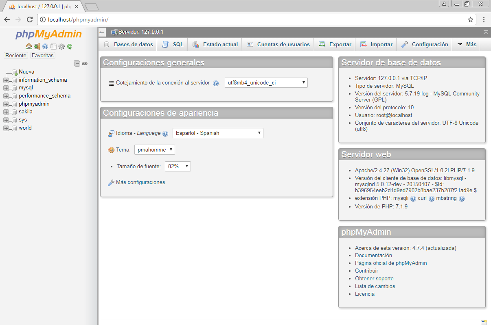

Para comprobar que podemos conectarnos a las bases de datos que tenemos por defecto en MySQL entramos en alguna de las bases de datos por defecto.

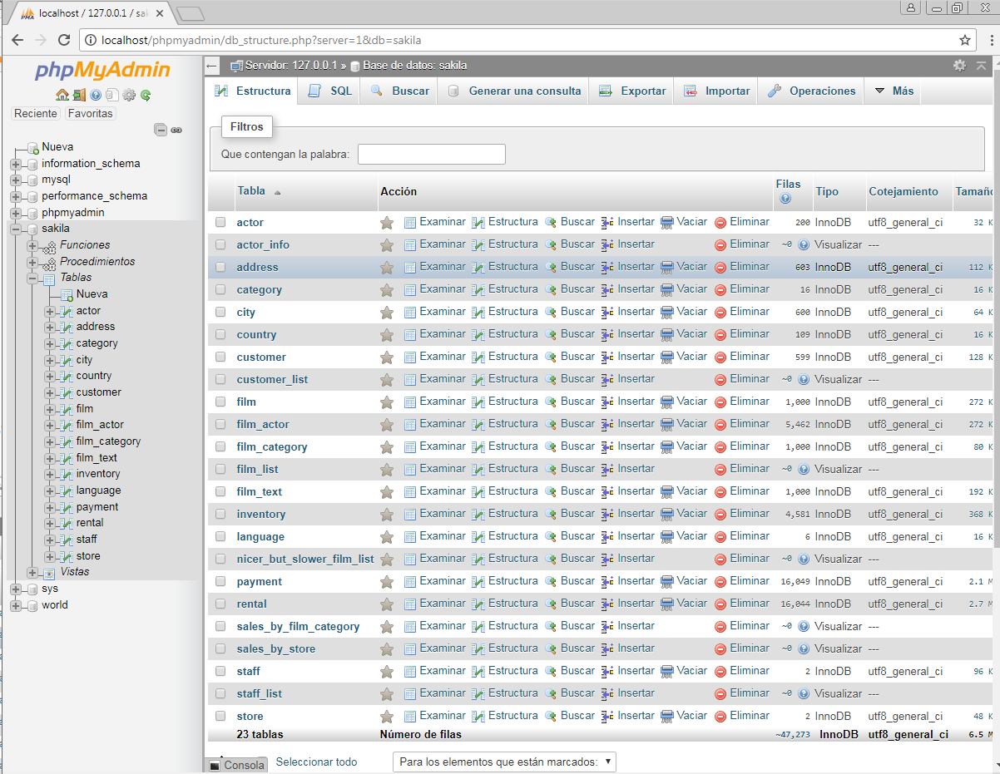

Ahora vamos a SQL y realizamos una consulta para ver que nos va correcto el phpMyAdmin.

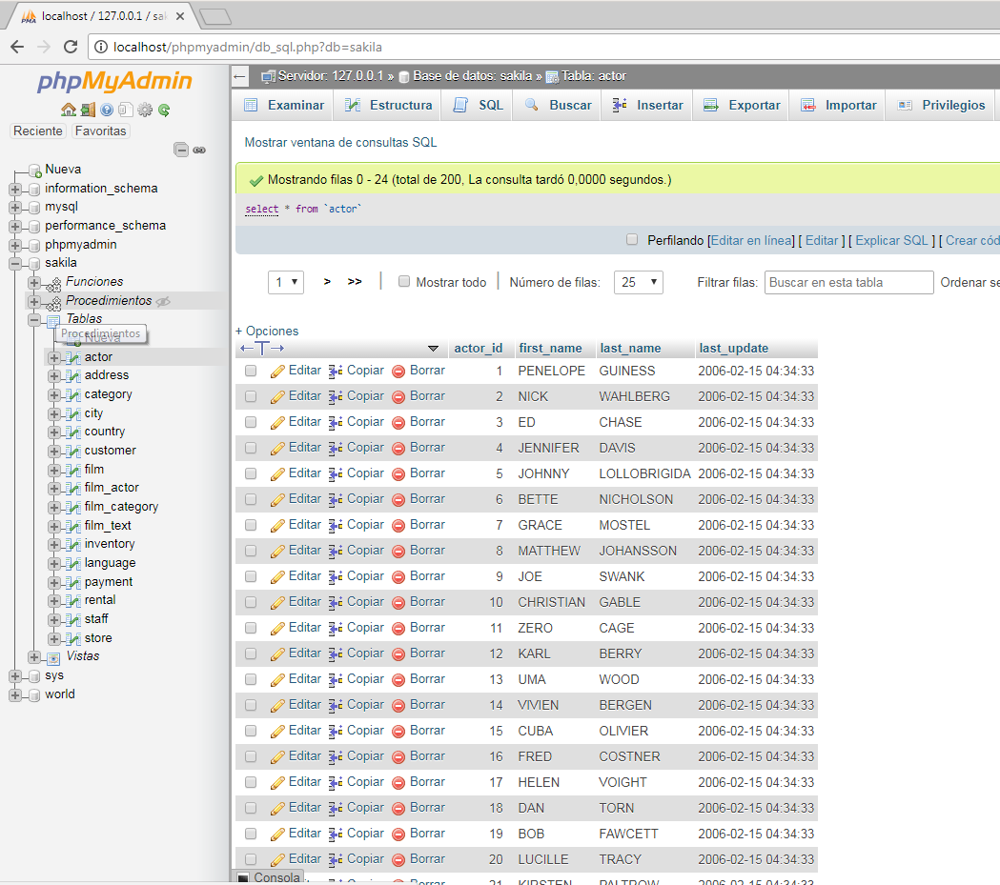
