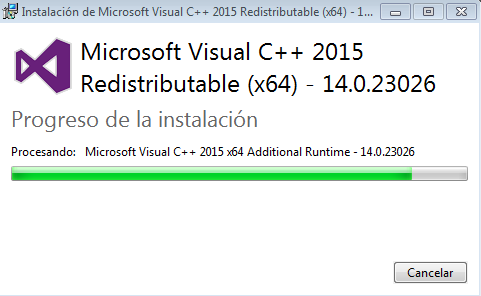
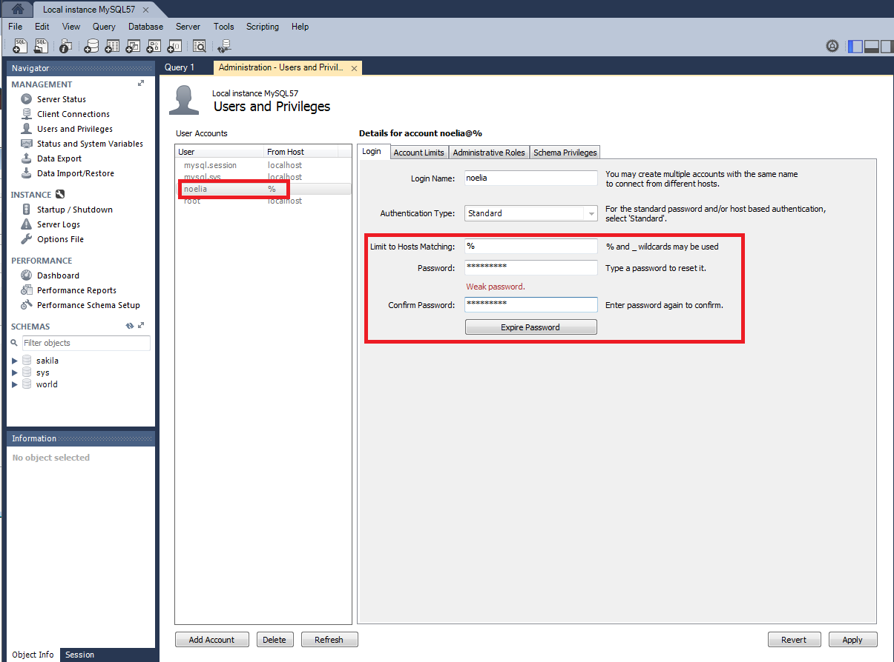
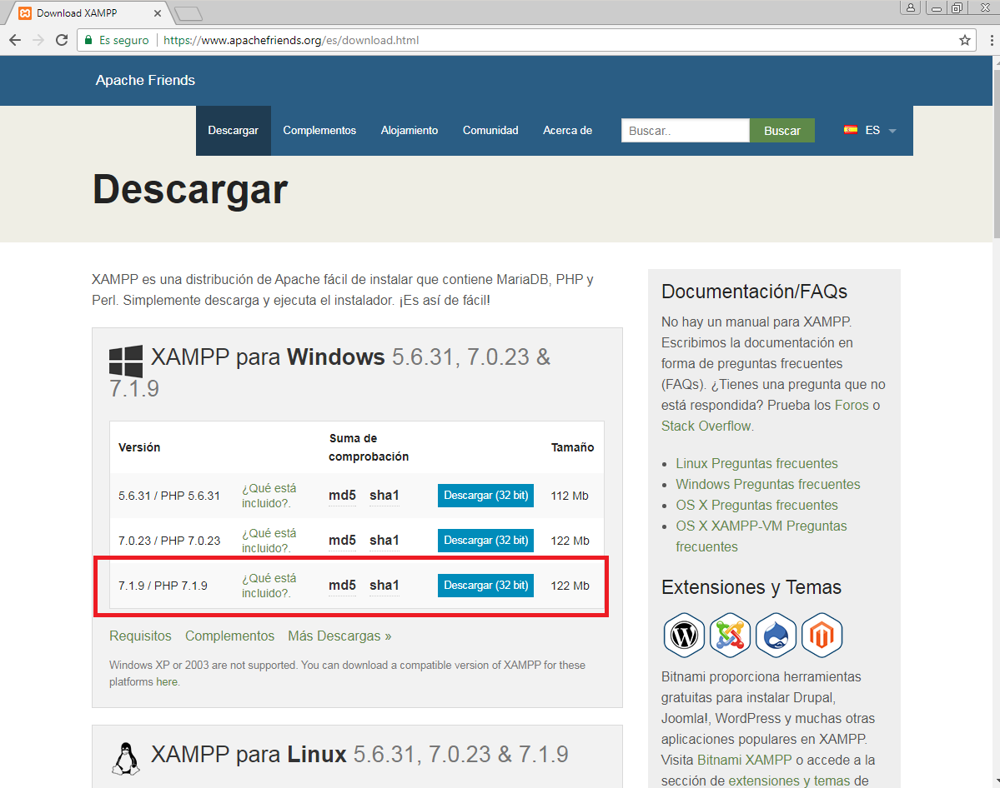

___

# U1. A2. Instalación De MySQL Community Sobre Windows.

En este informe vamos a hacer la instalación de MySQL Community y de MySQL Workbench ambos en Windows 7.

---

# 1. Descarga De MySQL Community En Windows 7 (Server).

Para hacer esta instalación debemos ir a la página de MySQL y debemos  descargarnos MySQL Installer 5.7.19.

___

# 2. Instalación Previa De MySQL En Windows 7 (Server).

Antes de instalar el MySQL Installer 5.7.19, tenemos que instalar dos programas para poder instalarlo.

* Lo primero que instalamos es el .NET Framework 4.5.2. Para ello nos lo descargamos de la página web que se nos proporciona y lo instalamos como podemos ver en las siguientes imágenes.

* Lo segundo que instalamos es el Microsoft Visual C++ 2015 Redistributable (x64). Para ello nos lo descargamos de la página web que se nos proporciona y lo instalamos como podemos ver en las siguientes imágenes.

# 3. Instalación De MySQL En Windows 7 (Server).

Ejecutamos el msi que nos descargamos del MySQL Installer 5.7.19 y para poder hacer la instalación solo tenemos que seguir las siguientes imágenes.

La instalación de MySQL Community debe ser en modo Developer Default.

//Hay tres tipos de servidor distintos para elegir, y el tipo que se escoja afectará a las decisiones que el asistente de configuración MySQL tomará en relación al uso de memoria, disco y procesador. Explicarlas.//

Le damos a ejecutar antes de seguir.

Le volvemos a dar a ejecutar.

Seguimos con las opciones por defecto.

Le ponemos una contraseña a nuestro root.

Seguimos con las opciones por defecto.

Volvemos a darle a ejecutar.

Seguimos con las opciones por defecto.

Revisamos que la contraseña concuerda con el usuario root.

Seguimos con las opciones por defecto.

Finalmente ya tenemos instalado

Anteriomente nos dio un problema instalando el MySQL Workbench 6.3.9 (x64), lo que hacemos es instalarlo al final.

Le damos al a ejecutar.

Finalmente ya tenemos instalado el MySQL Workbench 6.3.9.

Entramos a la línea de comandos cuando ya se nos instala el MySQL 5.7.19.

Comprobamos que tenemos podemos acceder a las bases de datos que vienen por defecto de MySQL.

___

# 4. Ruta De Instalación De MySQL En Windows 7 (Server).

___

# 5. Descarga De MySQL Workbench En Windows 7 (Cliente).

Para hacer esta instalación debemos ir a la página de MySQL y debemos  descargarnos MySQL Workbench 6.3.9.

___

# 6. Instalación Previa De MySQL Workbench En Windows 7 (Cliente).

Antes de instalar el MySQL Workbench 6.3.9, tenemos que instalar dos programas para poder instalarlo.

* Lo primero que instalamos es el .NET Framework 4.5.2. Para ello nos lo descargamos de la página web que se nos proporciona y lo instalamos como podemos ver en las siguientes imágenes.

* Lo segundo que instalamos es el Microsoft Visual C++ 2013 Redistributable (x64). Para ello nos lo descargamos de la página web que se nos proporciona y lo instalamos como podemos ver en las siguientes imágenes.

___

# 7. Instalación De MySQL Workbench En Windows 7 (Cliente).

Ejecutamos el msi que nos descargamos del MySQL Workbench 6.3.9. y para poder hacer la instalación solo tenemos que seguir las siguientes imágenes.

Seguimos con las opciones por defecto.

# 8. Crear Usuario En El Servidor.

Lo primero es crear un usuario en el Servidor, con otro nombre distinto al root, en mi caso se llama noelia y tiene una contraseña para poder acceder.

Luego le damos el role de DBA para poder acceder.

Dejamos al usuario root solo como localhost.

# Configuración modo remoto en el servidor de MYSQL desde Workbench

También en Options File, en Networking señalamos la opción bind-address, en concreto * .

# 9. Conectarse Con El Workbench Cliente Al Servidor.

Ahora tenemos que volver al cliente y ponemos nuestros datos que hemos creado en el Workbench Servidor.

Nos pide la contraseña que hemos creado.

Finalmente nos deja entrar desde el Workbench del Cliente al Workbench del Servidor.

Para probarlo podemos ver que

