___

# U1. A3. Instalación De MySQL Server En Ubuntu.

Instalamos MySQL Server desde el gestor de paquetes.

Mientras se va instalando mysql-server nos va a pedir una contraseña para el usuario root de mysql-server.

Indicamos que versión estable se instala desde el repositorio.

Instalamos MySQL Cliente desde el gestor de paquetes.

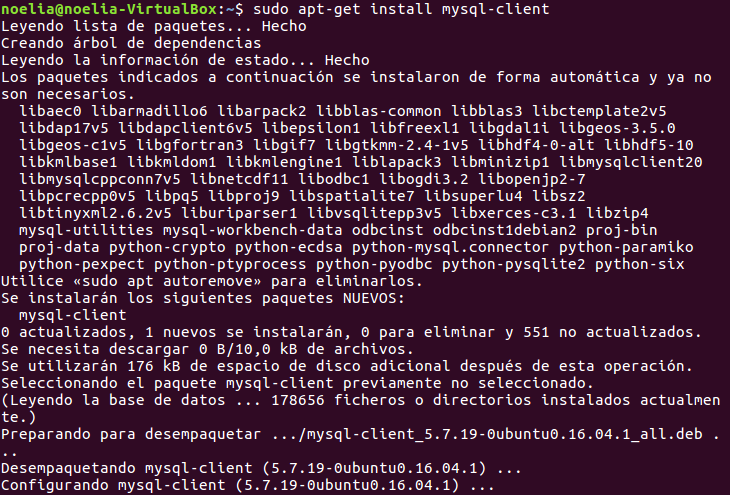

Reiniciamos el demonio mysqld, que arranca el núcleo de SGBD.

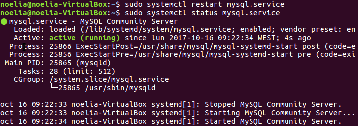

Probamos que este corriendo el proceso con el comando ps aux | grep mysql.

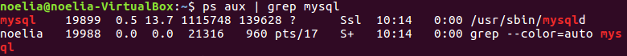

Configuración de la seguridad post-instalación, ejecutamos el comando mysql_secure_installation.

Instalamos MYSQL Workbench.

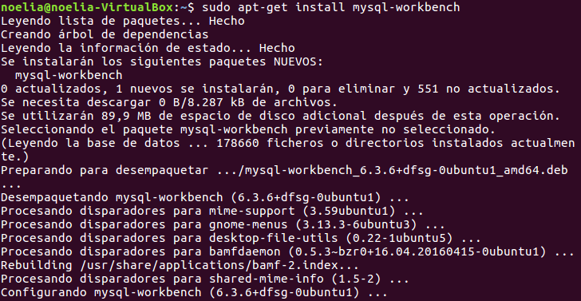

Instalamos el PHPMYAdmin sobre Apache.

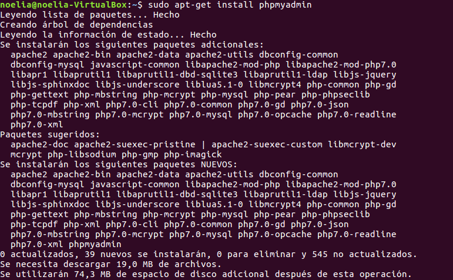

Cuando se va instalando todo nos va a pedir que servidor web queremos utilizar, en mi caso Apache2.

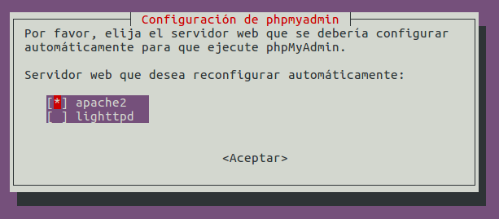

Mientras se va instalando el PHPMYAdmin nos va a pedir una contraseña para la aplicación MySQL de PHPMYAdmin.

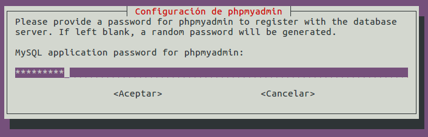

Finalmente entramos a un navegador web y ponemos localhost.

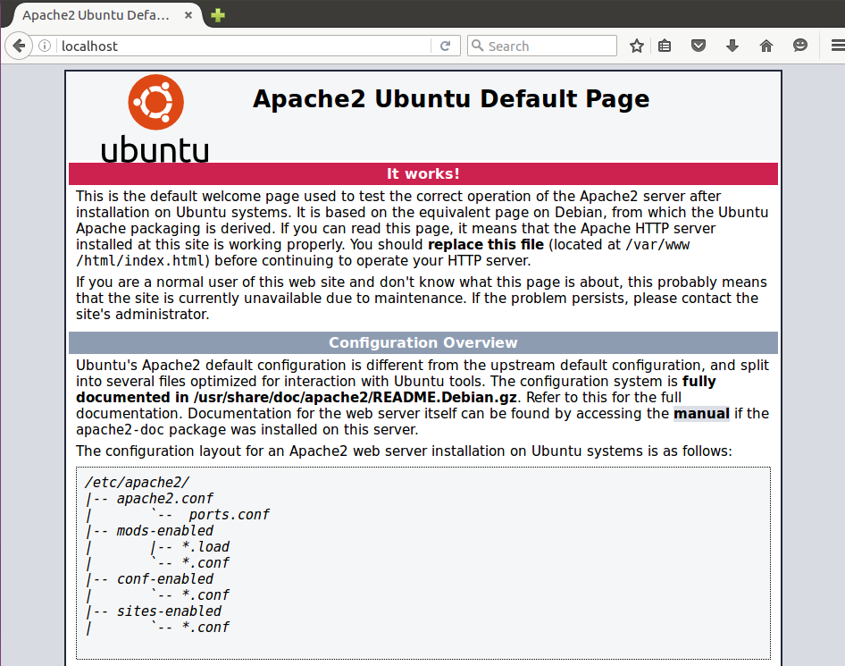

Ahora ponemos despues de localhost phpmyadmin y nos aparecera lo siguiente.

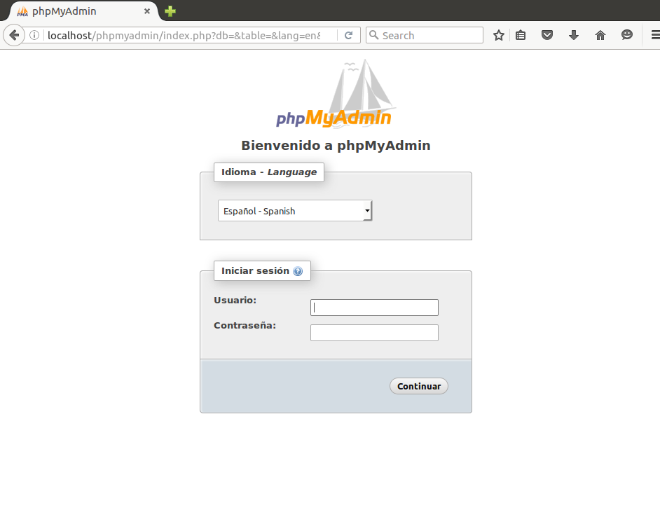

Ponemos la contraseña y veremos lo siguiente.

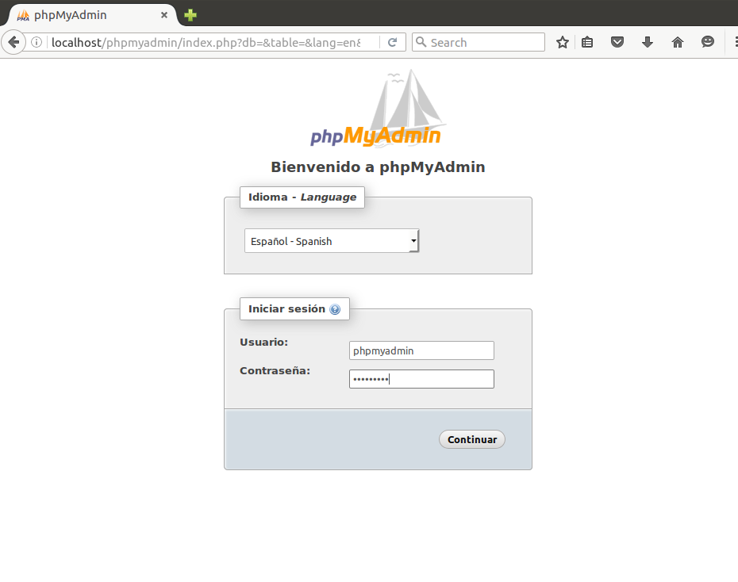

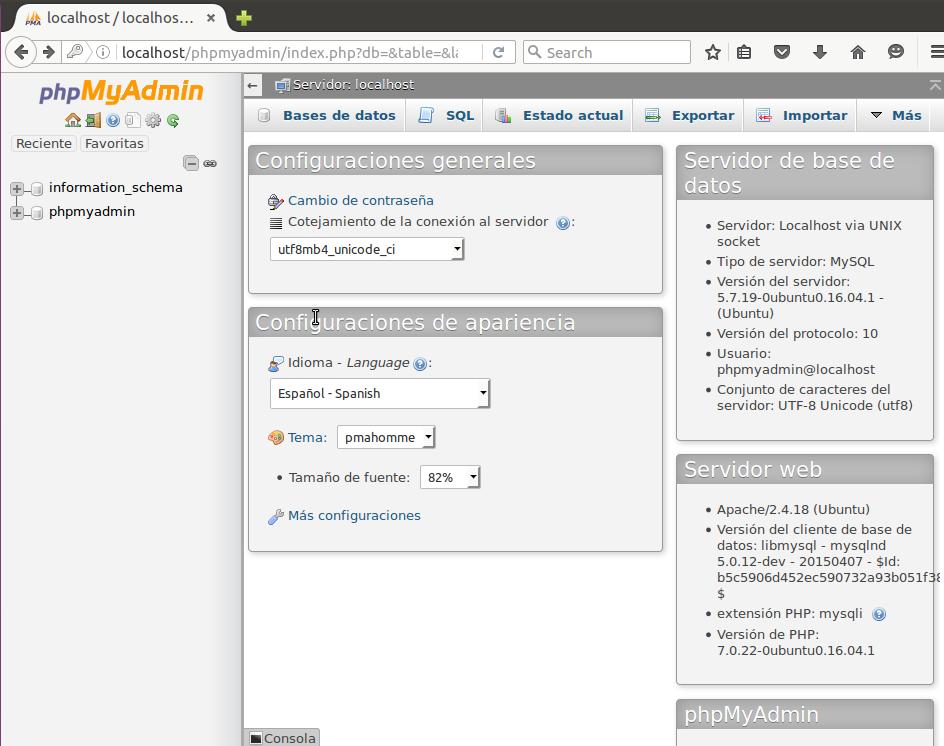

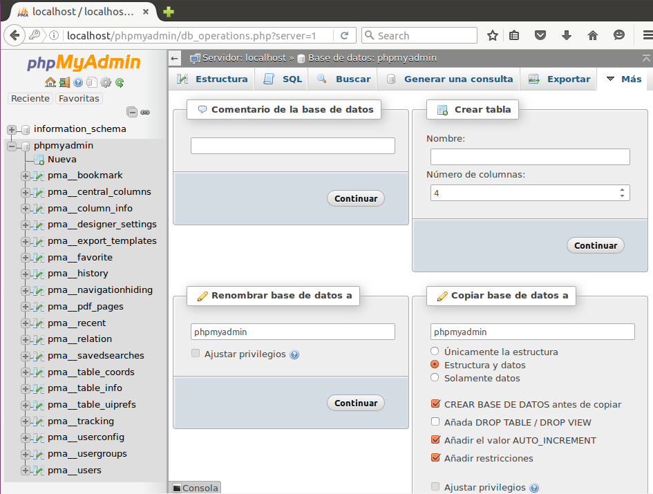

Dentro de la instalación de PHPMYAdmin tenemos que indicar lo siguiente:

* El Directorio de instalación base.

* El Directorio del servicio o proceso demonio.

>

* El Directorio de datos.

* El Fichero de configuración del servidor y su ubicación.

>

* Aplicar el lenguaje de los mensajes de error a español, modificando la configuración, también indicamos el directorio donde se aloja el fichero en español.

* Vemos que el usuario propietario de la instalación es

Probamos la conexión al servidor, utilizando el programa cliente mysql.

>

___
