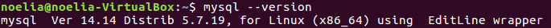
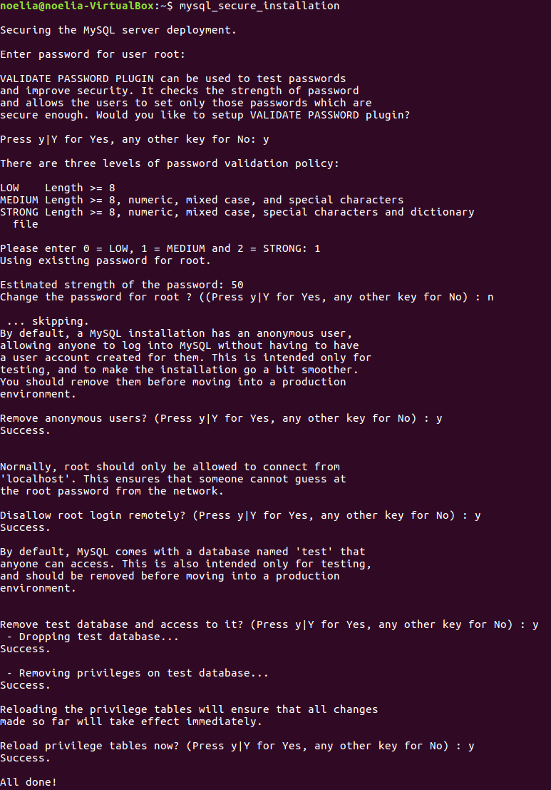
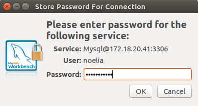

___

# **U1. A3. Instalación De MySQL Server En Ubuntu.**

---

# **1. Instalaciones.**

Instalamos MySQL Server desde el gestor de paquetes.

Mientras se va instalando MySQL Server nos va a pedir una contraseña para el usuario root de mysql-server.

Indicamos que versión se instala desde el repositorio de MySQL Server.

Instalamos MySQL Cliente desde el gestor de paquetes.

Reiniciamos y vemos el estado del demonio mysqld, el cual arranca el núcleo de SGBD.

Probamos que este corriendo el proceso, para ello utilizamos el comando ps aux | grep mysql.

Ahora configuramos la seguridad post-instalación, para ello ejecutamos el comando mysql_secure_installation.

Instalamos MYSQL Workbench.

---

# **2. PHPMYAdmin.**

Instalamos el PHPMYAdmin.

Cuando se va instalando todo nos va a pedir que servidor web queremos utilizar, en mi caso Apache2.

Mientras se va instalando el PHPMYAdmin nos va a pedir una contraseña para la aplicación MySQL de PHPMYAdmin.

Finalmente entramos a un navegador web y ponemos localhost.

Ahora ponemos después de localhost phpmyadmin y nos aparecerá lo siguiente.

Ponemos la contraseña y veremos lo siguiente.

Dentro de la instalación de PHPMYAdmin tenemos que indicar lo siguiente:

* El Directorio de instalación base es el siguiente.

* El Directorio del servicio o proceso demonio.

* El Directorio de datos.

* El Fichero de configuración del servidor, que es conffig.inc.php y su ubicación es la siguiente.

* Aplicamos el lenguaje de los mensajes de error a español, modificando la configuración, también indicamos el directorio donde se aloja el fichero en español.

* Vemos que el usuario propietario de la instalación es

---

# **3. Conexión Cliente-Servidor.**

Probamos la conexión al servidor, utilizando el programa cliente mysql. Para ello vamos a la consola del cliente y ponemos lo que aparece a continuación.

También podemos conectarnos de forma remota Cliente-Servidor por medio del Workbench. Para ello vamos al Workbench del Servidor y añadimos la ruta del archivo necesario para que funcione MySQL Workbench.

Para ello lo primero es ir al MySQL Workbench y añadir un nuevo usuario.

Dicho usuario tendrá todos los roles.

Luego vamos a Options File y en Networking añadimos bind-address y port.

Ahora añadimos una nueva conexión desde el MySQL Workbench del cliente.

Ponemos la contraseña de nuestro usuario creado en el servidor.

Finalmente entramos en nuestro usuario y probamos algún comando para ver que funciona correctamente.

___
