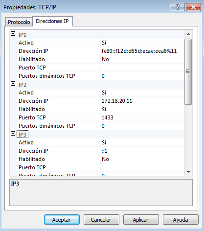
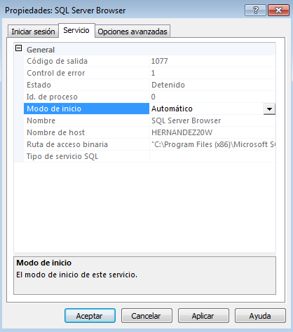

___

# **U1. A4. Instalación De SQL Server 2014 Express.**

En esta práctica realizaremos la Instalación y Configuración de SQL Server y SQL Server Management Studio.

---

# **1. Instalaciones En El Servidor.**

Vamos a instalar el SQL Server Express 2014 y el Management Studio en un Servidor Windows 7.

La versión que nos vamos a descargar de SQL Server Express 2014 ya cuenta con el Management Studio, es decir, solo tenemos que hacer una instalación.

Para poder instalar el SQL Server Express 2014 y el Management Studio tenemos que ir a [Microsoft](https://www.microsoft.com/es-es/download/details.aspx?id=42299).

Nos descargamos la versión que tiene 1.2 GB porque es la versión más completa.

Empezamos la instalación.

Realizamos un proceso donde nos detecta las reglas que queremos instalar.

Seleccionamos las características que queremos instalar. Instalaremos las que vienen por defecto.

Configuramos el nombre de la instancia.

Configuramos las cuentas de servicio.

Especificamos el modo de autentificación.

Seleccionamos que queremos Instalar y configurar.

Finalmente comienza la instalación.

Se completa la instalación.

---

# **2. Comprobaciones Del Acceso Local.**

Tenemos que comprobar el acceso local desde Management Studio a la instancia de SQL Server.

Para poder comprobar este acceso local tenemos que entrar al Management Studio.

Ahora tenemos que introducir el nombre del servidor para poder conectarnos a la instancia de SQL Server.

Finalmente nos permite conectarnos de forma local.

---

# **3. Instalaciones En El Cliente.**

Instalamos Management Studio en un Cliente Windows 7.

Para poder instalar el Management Studio tenemos que ir a [Microsoft](https://docs.microsoft.com/es-es/sql/ssms/download-sql-server-management-studio-ssms).

Empezamos la instalación.

La instalación del Management Studio puede durar varios minutos.

Finalmente ya tenemos instalado el Management Studio en el Cliente.

---

# **4. Configuración Para Acceso Remoto.**

Para poder conectarnos desde el Cliente al Servidor tenemos que cambiar unas configuraciones.

Lo primero que tenemos que hacer es crearnos un usuario para poder conectarnos desde remoto.

Creamos un nuevo inicio de sesión.

Primero tenemos que poner el nombre del usuario y su contraseña.

Le damos roles del servidor a este usuario.

Le asignamos una base de datos a este usuario.

Le tenemos que conceder permisos de conexión y también habilitar el inicio de sesión.

Tenemos también de cambiar las propiedades del servidor, en concreto tenemos que darle la autentificación del servidor por medio de Windows y SQL Server.

También tenemos que permitir las conexiones remotas con este servidor.

A continuación tenemos que ir a SQL Server Configuration Manager.

Nos aparecen los protocolos de SQLEXPRESS.

Habilitamos los protocolos de SQLEXPRESS.

Luego tenemos que cambiar unas propiedades en TCP/IP.

Habilitamos la dirección IP 172.18.20.11 en el puerto 1433.

Volvemos a los Servicios de SQL Server.

Entramos en SQL Server Browser y ponemos en Servicio su modo de inicio automático.

Ahora iniciamos este servicio.

Ahora vamos al cortafuegos del Servidor y del Cliente y tenemos que añadir nuevas reglas para que nos permita acceder por el puerto que añadimos anteriormente.

Vamos a añadir nuevas reglas de entrada.

Vamos a añadir regla y creamos una regla por el Puerto.

Tenemos que poner el protocolo TCP y el puerto local 1433.

Permitimos la conexión.

Ya tenemos creada la regla de entrada para el Servidor y para el Cliente.

Vamos a añadir nuevas reglas de salida.

Vamos a añadir regla y creamos una regla por el Puerto.

Tenemos que poner el protocolo TCP y el puerto local 1433.

Permitimos la conexión.

Ya tenemos creada la regla de entrada para el Servidor y para el Cliente.

Ahora tenemos que crear otra nueva regla pero esta vez tendrá el protocolo UDP.

Vamos a añadir una nueva regla de entrada.

Vamos a añadir regla y creamos una regla por el Puerto.

Tenemos que poner el protocolo UDP y el puerto local 1434.

Permitimos la conexión.

Ya tenemos creada la regla de entrada para el Servidor.

Vamos a añadir una nueva regla de salida.

Vamos a añadir regla y creamos una regla por el Puerto.

Tenemos que poner el protocolo UDP y el puerto local 1434.

Permitimos la conexión.

Ya tenemos creada la regla de salida para el Servidor.

Finalmente reiniciamos el servicio de SQL Server.

---

# **5. Acceso Remoto.**

Ahora nos tenemos que conectar desde Management Studio del Cliente Windows 7 a la instancia de SQL Server del Servidor Windows 7, tanto por nombre de máquina como por IP.

Abrimos el SQL Server Management Studio en el Cliente Windows 7.

Introducimos el nombre del servidor, utilizando la autentificación de SQL Server, usuario y contraseña.

Nos conecta al Servidor.

Ahora introducimos la IP del servidor, utilizando la autentificación de SQL Server, usuario y contraseña.

Nos conecta al Servidor.

---
