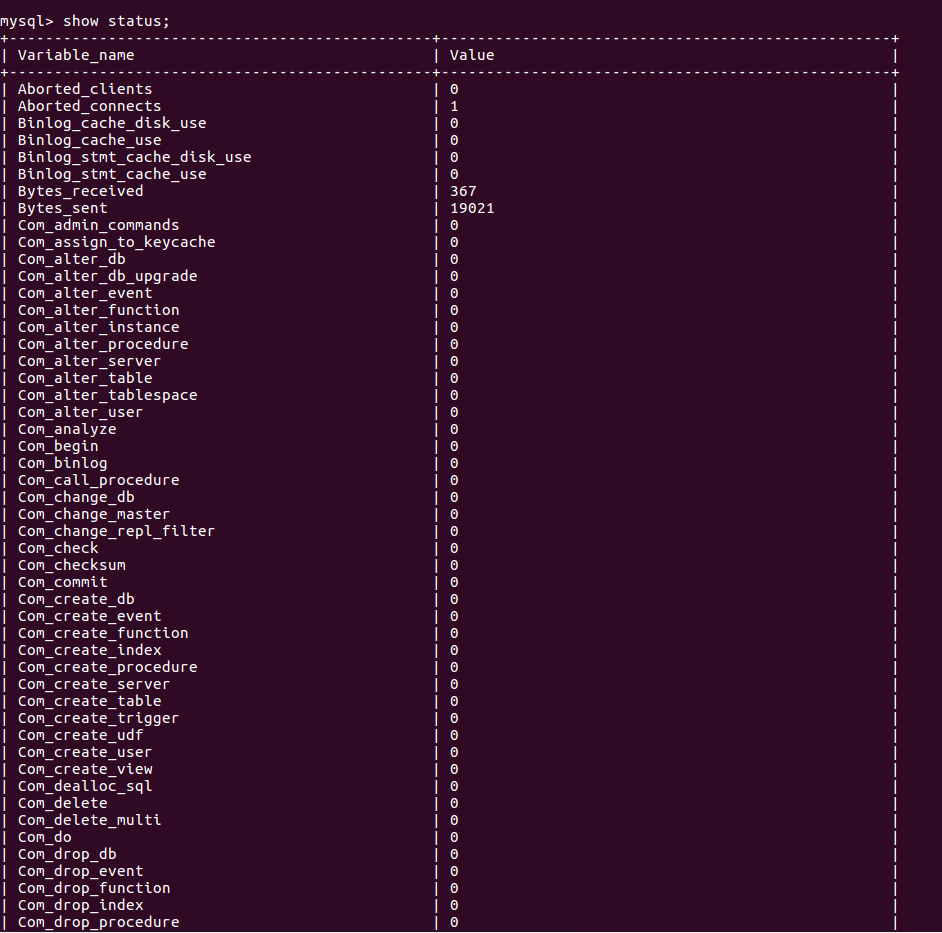

___

# **U2. A2. Fichero De Opciones Y Variables De Servidor.**

---

## **1. Ficheros De Opciones.**

### **Ajustar Variables Con Ficheros De Opciones.**

1. Hacemos la lectura de la siguiente página "Using Option Files".

`http://dev.mysql.com/doc/refman/5.7/en/option-files.html`.

2. Encontramos el fichero my.cnf de mi instalación de MySQL.

El fichero my.cnf se encuentra en `/etc/mysql/`.

3. ¿Cómo se escribe un comentario en este fichero? ¿Y un grupo de opciones? ¿Todas las opciones tienen un valor?

En este fichero se escribe un comentario poniendo "#".

En un grupo de opciones se escribe poniendo "[group]".

4. Ejecutamos "mysqld --verbose --help" desde una consola para ver una lista de las variables del servidor.

5. Explicamos qué significan y que se consigue con cada una de las variables del siguiente fichero de configuración.

~~~
[client]
port=3306
password="telesforo";

[mysqld]
port=3306
key_buffer_size=16M
max_allowed_packet=8M

[mysqldump]
quick
~~~

* client es un grupo por todos los clientes que hay en MySQL, conectado por el puerto 3306, con una contraseña que es telesforo.

* mysqld es un grupo asociado al mysqld server, conectado por el puerto 3306.

* mysqldump es un grupo y solo puede ser leido por mysqldump.

---

## **2. Variables Del Servidor.**

Hacemos la lectura de los siguientes enlaces y respondemos documentando las preguntas.

"Server System Variables"
`http://dev.mysql.com/doc/refman/5.7/en/server-system-variables.html`.

"Using System Variables"
`http://dev.mysql.com/doc/refman/5.7/en/using-system-variables.html`.

1. Definimos qué son las variables del servidor.

Las variables del Servidor son las variables del sistema que se pueden configurar al inicio el servidor usando opciones en la línea de comando o en un archivo de opciones.

2. Usamos el comando "SHOW VARIABLES" para conocer el valor de todas las variables y enviamos el resultado a un fichero.

3. Repetimos lo anterior para mostrar solo las variables relacionadas con el motor "InnoDB".

4. Para gestionar variables tenemos, como hemos visto, el comando SHOW "comando".

* Cómo mostrar todos los motores de almacenamiento.

* Cómo mostrar el estado actual del servidor.

* Cómo averiguar todos los clientes que están conectados al servidor.

* Cómo conocer todas las tablas que están abiertas.

---

## **Variables De Estado.**

Hacemos la lectura de los siguientes enlaces y respondemos documentando las preguntas.

"Server Status Variables"
`http://dev.mysql.com/doc/refman/5.7/en/server-status-variables.html`.
"SHOW STATUS Syntax"
`http://dev.mysql.com/doc/refman/5.7/en/show-status.html`.
"SHOW Syntax"
`http://dev.mysql.com/doc/refman/5.7/en/show.html`.

1. Definimos qué son las variables de estado.

Las variables de estado proporcionan información sobre el funcionamiento del Servidor MySQL. También proporcionan recuentos de declaraciones.

2. Usa el comando "SHOW STATUS" para conocer el valor de todas las variables.

3. Haz que uno o más de tus compañeros se conecte a tu servidor.

4. Comprobamos quién está conectado usando el comando correspondiente.

5. Intentamos desconectarlo con el comando "kill"

6. ¿Cuántas consultas se están ejecutado hasta el momento en tu servidor MYSQL? ¿Y si se trata de consultas lentas?

7. Un estado informa el sobre el máximo de conexiones concurrentes que se ha dado en la sesión de trabajo. ¿Cuál es?

---

## **Variables Dinámicas.**

Hacemos la lectura de los siguientes enlaces y contestamos razonadamente a las preguntas.

"Dynamic System Variables"
 `http://dev.mysql.com/doc/refman/5.7/en/dynamic-system-variables.html`.
"SET Syntax"
`http://dev.mysql.com/doc/refman/5.7/en/set-statement.html`.

1. Detalla los posibles atributos que tendría una variable de servidor como "port".

2. ¿Cómo podemos saber si una variable es dinámica o no?

Usando select podemos comprobar que valor tiene cada variable.

3. ¿Qué hace la variable "uptime"?

La cantidad de segundos que ha estado el Servidor.

¿Es posible modificar su valor con comando SET?

Si, poniendo set global o set session.

4. Localizamos la variable que establece el límite de conexiones concurrentes. ¿Cuál es?

Es concurrent_insert.

Modificamos y establecemos un máximo de 100 conexiones concurrentes.

---
