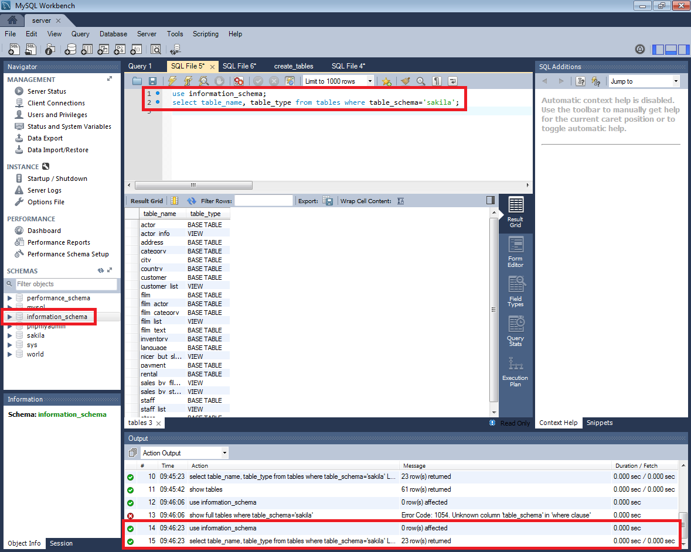
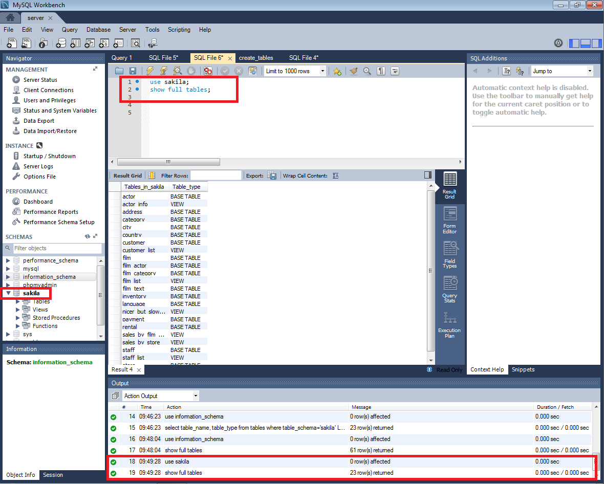

___

# **U2. A3. Diccionario De Datos.**

## **Estructura Del Diccionario De Datos.**

---

Hacemos la lectura de las siguientes páginas y respondemos a las preguntas razonadamente.

* "INFORMATION_SCHEMA" `http://dev.mysql.com/doc/refman/5.7/en/information-schema.html`.

* "The INFORMATION_SCHEMA TABLES" `http://dev.mysql.com/doc/refman/5.7/en/tables-table.html`.

---

1. Interrogando la bases de datos Information_schema, extrae información (atributos table_name, table_type) sobre las tablas que conforman la base de datos "sakila".

2. ¿Cuál es el comando SHOW equivalente al anterior?.

3. Repite lo mismo extrayendo la información sobre el esquema de una tabla en particular de la base de datos "sakila" (atributos column_name, data_type, is_nullable, column_default). Usar tabla columns.

4. ¿Cuál es el comando SHOW equivalente al anterior?.

5. Atendiendo a la base de datos "Information_schema", ¿cuáles son las tablas principales según tu criterio? Puedes ayudarte para ver todas las tablas utilizando Workbench. Para ello ir a preferencias y activar ver los metadatos.

Las tablas principales según mi criterio son

---
