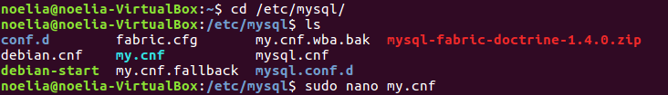
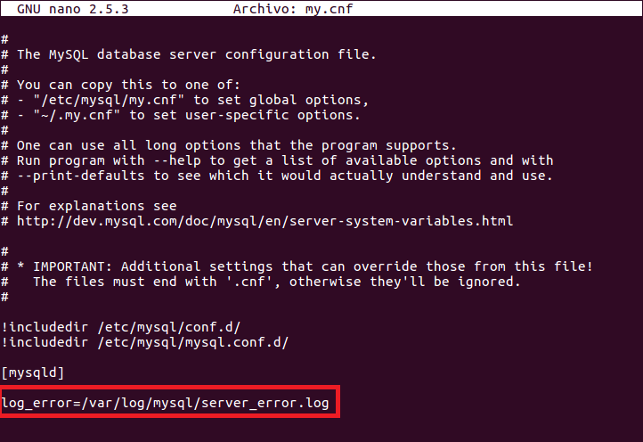
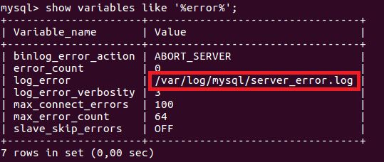
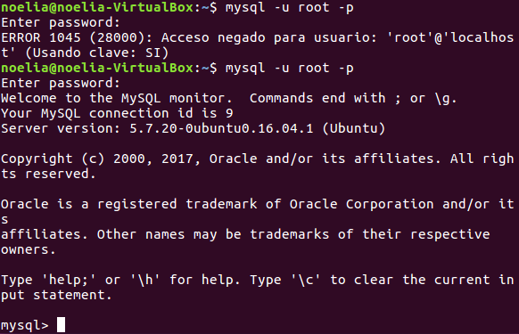
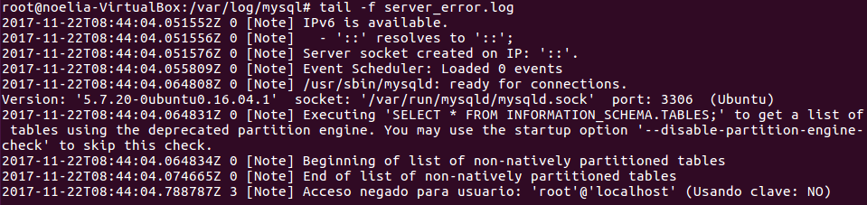

___

# **U2. A4. Ficheros Log.**

---

## **Ficheros LOG: Error LOG.**

El fichero "Error Log" registra problemas encontrados iniciando, ejecutando o parando mysqld.
Lee el pdf de la UD1.- Instalación y Configuración de un SGBD, la parte 5 de  Los Ficheros LOG
Haz la lectura de la siguiente página y contesta a las preguntas razonadamente:

* MySQL Server Logs: `http://dev.mysql.com/doc/refman/5.7/en/server-logs.html`.

* The Error Log: `http://dev.mysql.com/doc/refman/5.7/en/error-log.html`.

1. Explica qué es y para qué sirve el "ERROR LOG"

2. Indica al servidor en "my.cnf" que registre los errores en un fichero llamado "server_error". Reinicia el servidor y comprueba los mensajes visualizando dicho fichero.

Vamos al fichero my.cnf que se encuentra en `/etc/mysql`.

Editamos my.cnf.

Miramos que ahora en la variable de errores se encuentra el server_error.log.

Encendemos el servicio de errores.

Reiniciamos el Servidor.

Comprobamos los mensajes visualizando dicho fichero.

3. Detén el servidor abruptamente (haz lo que sea necesario) y comprueba cómo se ha modificado dicho fichero.

4. Prueba la función "perror" incluida en el directorio bin. ¿Cuál es su objeto? Puedes consultar http://dev.mysql.com/doc/refman/5.7/en/perror.html.

---

## **Ficheros LOG: General Query LOG.**

El fichero "Global Query  Log" registra las conexiones establecidas por los clientes y las sentencias ejecutadas por ellos.

Haz la lectura de la siguiente página y contesta a las preguntas razonadamente:

* MySQL Server Logs: `http://dev.mysql.com/doc/refman/5.7/en/server-logs.html`.

* The General Query Log: `http://dev.mysql.com/doc/refman/5.7/en/query-log.html`.

show variables like 'general_log%'

set global general_global=1;

1. Explica qué es y para qué sirve el "GENERAL QUERY LOG"

2. Configura MySQL para registrar consultas generales en el fichero denominado "miserver.log". Comprueba su funcionamiento haciendo que un compañero se conecte a tu servidor y ejecute varias consultas.

3. Averigua viendo el fichero "miserver.log" la hora en que se conectó tu compañero y ejecutó las consultas del apartado anterior.

4. Accede al servidor a través de Workbench. ¿Qué se registra en "general_log"?¿Hay alguna diferencia respecto al cliente mysql ?

---
