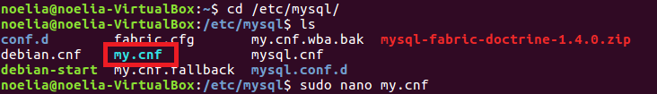
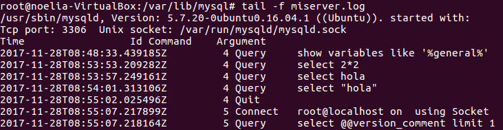

___

# **U2. A4. Ficheros Log.**

---

## **Ficheros LOG: Error LOG.**

Hacemos la lectura de las siguientes páginas y contestamos a las preguntas razonadamente.

* MySQL Server Logs: `http://dev.mysql.com/doc/refman/5.7/en/server-logs.html`.

* The Error Log: `http://dev.mysql.com/doc/refman/5.7/en/error-log.html`.

1. Explicamos qué es y para qué sirve el "ERROR LOG"

Error Log contiene detalles de problemas que se dan durante el inicio y ejecución del motor de base de datos. Contiene detalles del arranque y apagado del motor de MySQL, detalles del progreso de estos eventos y de errores críticos que pueden ocurrir durante la ejecución del Servidor. Si el programa mysqld nota que una tabla necesita ser revisada o reparada escribe este mensaje en el Error Log.

2. Indicamos al Servidor en "my.cnf" que registre los errores en un fichero llamado "server_error.log". Reiniciamos el Servidor y comprobamos los mensajes visualizando dicho fichero.

Vamos al fichero my.cnf que se encuentra en `/etc/mysql`.

Editamos `my.cnf`.

Miramos que ahora en la variable de errores se encuentra el `server_error.log`.

Reiniciamos el Servidor y el Servicio MySQL.

Comprobamos los mensajes visualizando dicho fichero, para ello realizamos alguna conexión fallida para que se vea algo en el fichero.

3. Detenemos el Servidor abruptamente y comprobamos cómo se ha modificado dicho fichero.

4. Probamos la función "perror" incluida en el directorio bin. ¿Cuál es su objeto? Podemos consultar `http://dev.mysql.com/doc/refman/5.7/en/perror.html`.

perror nos imprime una descripción de un error que nos ha surgido en MySQL.

---

## **Ficheros LOG: General Query LOG.**

Hacemos la lectura de las siguientes páginas y contestamos a las preguntas razonadamente.

* MySQL Server Logs: `http://dev.mysql.com/doc/refman/5.7/en/server-logs.html`.

* The General Query Log: `http://dev.mysql.com/doc/refman/5.7/en/query-log.html`.

1. Explicamos qué es y para qué sirve el "GENERAL QUERY LOG"

General Query Log es un registro de lo que el programa mysqld está realizando, el Servidor escribe información a este archivo de log cuando los Clientes se conectan y desconectan y guarda cada sentencia SQL recibida por parte de los usuarios, este registro es muy útil cuando se realiza la búsqueda de errores de un Cliente y se requiere conocer que envía este al motor de base de datos, en las líneas que se muestran que un Cliente se conecta indica el tipo de conexión que se realizó incluyendo el protocolo usado.

2. Configuramos MySQL para registrar consultas generales en el fichero denominado "miserver.log". Comprobamos su funcionamiento haciendo que un compañero se conecte al Servidor y ejecute varias consultas.

Vamos al fichero my.cnf que se encuentra en `/etc/mysql`.

Editamos `my.cnf`.

Miramos que ahora en la variable se encuentra el `miserver.log`. También podemos ver que el Servicio esta ON.

Hacemos varias consultas y comprobamos los mensajes visualizando dicho fichero.

3. Averiguamos viendo el fichero "miserver.log" la hora en que se conectó mi compañero y ejecutó las consultas del apartado anterior.

4. Accedemos al Servidor a través de Workbench. ¿Qué se registra en "general_log"? ¿Hay alguna diferencia respecto al Cliente mysql?

Entramos en mysql-workbench por comandos como superusuario.

Revisamos los Server Logs. Los cuales registran casi la misma información que el Cliente MySQL.

La diferencia respecto al Cliente MySQL es que en Workbench nos realiza una doble conexión del usuario.

---
