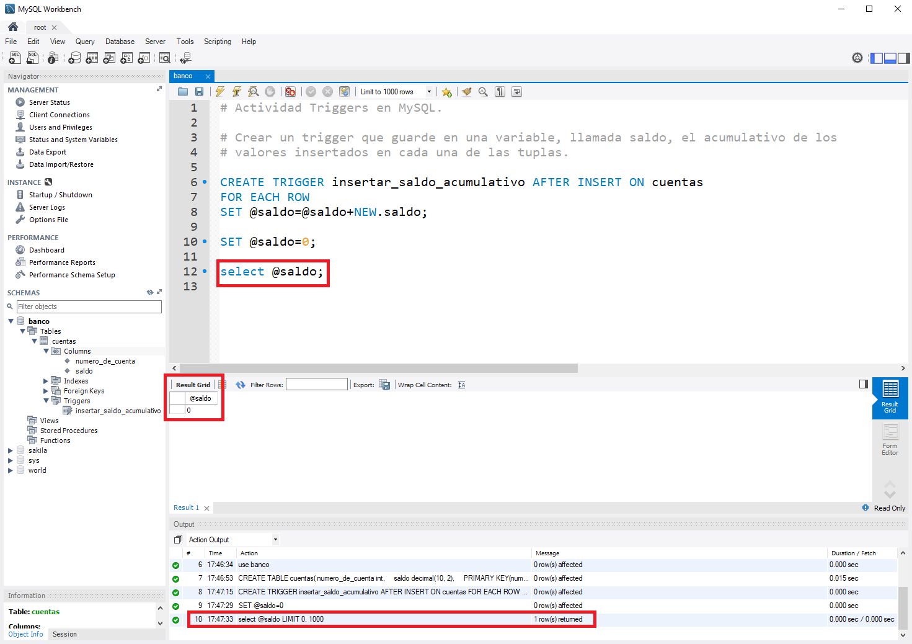

___

# **banco.sql.**

El archivo banco.sql de esta práctica es el siguiente.

[banco.sql](https://github.com/NoeClariNista/ade1718/blob/master/trim2/u4/a1/banco.sql)

---

# **Actividad Triggers En MySQL.**

---

Creamos una base de datos llamada banco.

Dentro de banco, creamos una tabla llamada cuentas que va a tener dos campos, número de cuenta (entero y clave primaria) y saldo (10 partes enteras y 2 partes decimales).

Creamos un Trigger que guarde en una variable, llamada saldo, el acumulativo de los valores insertados en cada una de las tuplas.

Insertamos valores y comprobamos el total de saldo insertado con un select.

Creamos también un Trigger que reste cuando eliminamos una tupla.

Comprobamos el total del saldo después de los borrados.

---
